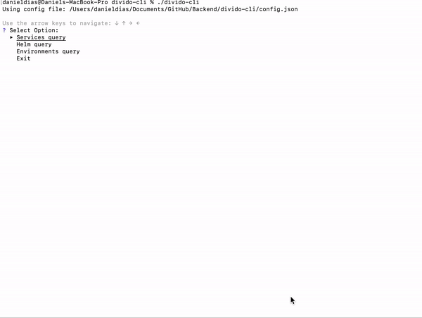
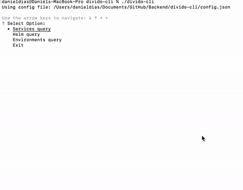
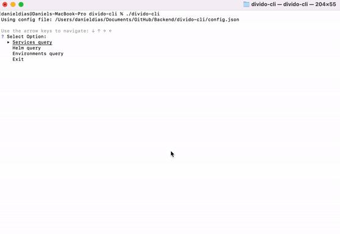
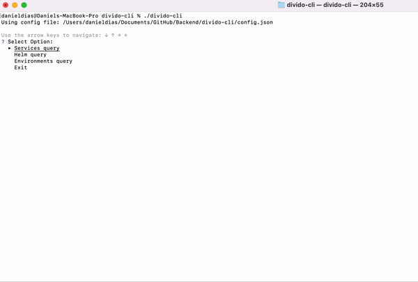
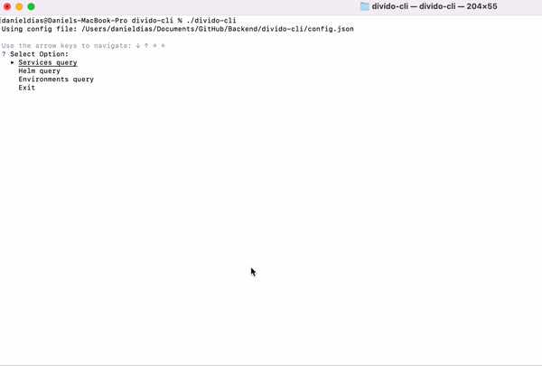

# divido-cli

An interactive prompt cli to help Divido devs manage services and GitHub Helm updates

All via GITHUB API, grabbed GITHUB_TOKEN from env variable if possible.

## Usage
In order to utilize this you're going to need:
- A GitHub Personal Access token setup and configured on your GitHub profile and local machine

    - You can setup a token by logged into GitHub, [visit your account tokens page](https://github.com/settings/tokens) visit your account tokens page —> create a new token
    - The only permissions required is `repo`
    - Open a new terminal and run `export GITHUB_TOKEN="[TOKEN HERE]"` (no square brackets or quotes)
    - run `echo $GITHUB_TOKEN` —> verify you see your token
- A config file to load the configuration of all platforms, environments and services.
    - By default, it will load a config.json file from the executable directory
    - If you have a different file, you can use:
  
  ```shell
    $ ./divido-cli --config=FILE_PATH 
    ```

## Config File
An example input configuration file is shown below:

```json
{
  "github" : {
    "org": "dividohq",
    "preCommitMessage": "chore(autocommit)",
    "commitMessageBumpHc": "Automatic bump hc",
    "commitMessageBumpService": "Automatic bump service(s)",
    "authorName": "dividotech",
    "authorEmail": "tech@divido.com",
    "mainBranch": "master"
  },
  "platforms": [
  {
    "name": "divido",
    "hlm": "divido-platform-hlm",
    "directCommit": true,
    "envs": [
      {
        "name": "test",
        "repo": "test-k8s-services-inf",
        "chartPath": "configs/versions.yaml",
        "directCommit": true,
        "onlyOverrides": true
      }
     ]
  }
  ],
  "services": [
    {
      ".*Portal.*WebPub$": {
        "repo": "portals-web-pub"
      },
      ".*GraphqlApi.*": {"repo": "graphql-apis", "multi-tag":  true}
    }
  ]

}
```

`github` sets the default configuration to access GitHub, create commits and pull requests (can be changed in the cli before m)

`platforms` sets the configuration to access and load the helm charts and respective environments
- `directCommit` Indicates if the version changes would be made by a single commit or a pull request. 
- `onlyOverrides` Indicates if an environment is only updated via overrides and not helm version (e.g. divido testing env)

`services` sets the matching of naming in chart files to the respective repository 
- `multi-tag` To indicate if the repository versions are deployed using multiple services (e.g. graphql-apis)
  
## Features

- show services deployed in an environment  (e.g. see all services deployed in ING testing)
- show services in a helm chart  (e.g. see all services in a specific (v1.31.65) ING Helm chart)
- diff between helm charts 
- generate changelog between two given helm charts (v1.2.3 -> v1.2.4)
- update a service version in a helm chart
- update a helm chart version in an environment

### Show Service information (e.g portals-web-pub)




### Show services deployed in a specific helm (e.g. ING)



### Compare services deployed in a specific helm versions and export release (e.g ING)



### Update services deployed in a specific helm (e.g. ING)



### Show services in a specific env and update its helm version  (e.g. ING test)


